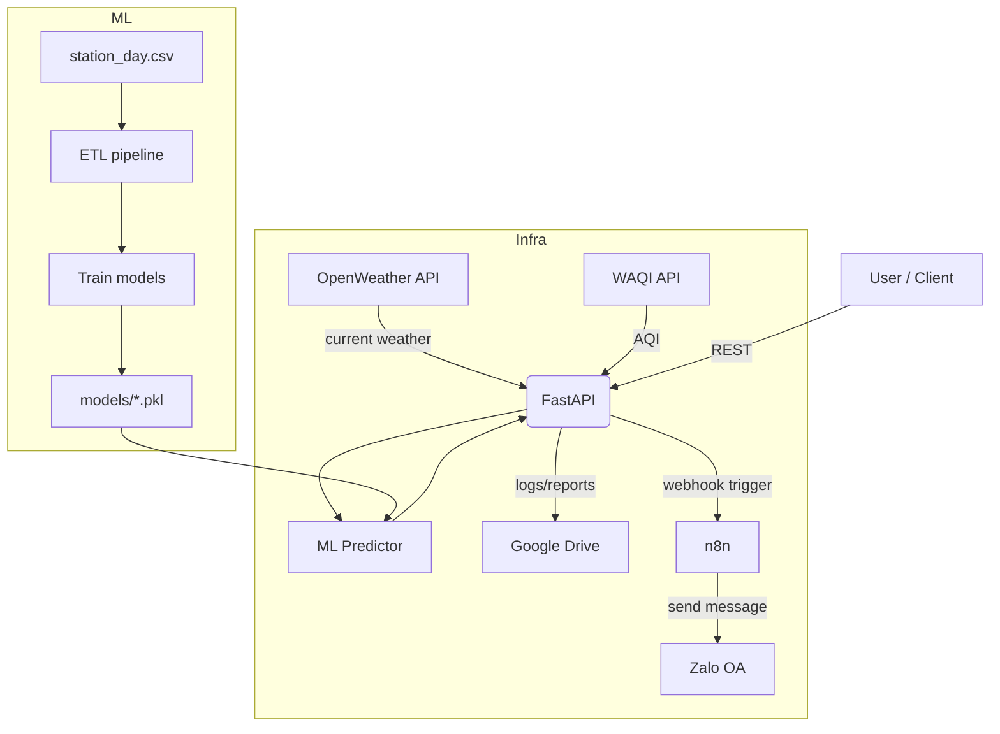
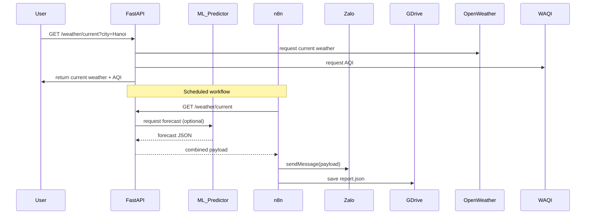

## Tổng quan quy trình hoạt động của đồ án

Tài liệu này mô tả luồng hoạt động, thành phần và nghiệp vụ chính của hệ thống Dự báo Thời tiết + AQI (FastAPI + ML + n8n + Zalo + Google Drive).

Mục tiêu chính:
- Cung cấp dữ liệu thời tiết và chất lượng không khí theo thời gian thực (OpenWeatherMap, WAQI).
- Sinh dự báo ML (PM2.5, AQI) dựa trên dữ liệu lịch sử đã được ETL/huấn luyện.
- Tự động gửi thông báo/khuyến nghị tới người dùng qua Zalo OA.
- Lưu nhật ký và báo cáo lên Google Drive.

---

## Kiến trúc tổng thể

Các thành phần chính:
- FastAPI (ai-assistant): REST API cho real-time và ML forecasts.
- ML pipeline: ETL (`scripts/etl_pipeline.py`) + training (`scripts/train_model.py`) -> lưu model vào `models/`.
- n8n: workflow engine dùng để lắng nghe webhook, gọi API và gửi tin nhắn Zalo, lưu lên GDrive.
- Zalo OA: kênh gửi thông báo tới người dùng.
- Google Drive: lưu báo cáo/nhật ký.
- Docker / docker-compose: container hóa FastAPI và n8n.

Mermaid: kiến trúc (flowchart)



---

## Luồng nghiệp vụ chính (business flows)

1) Luồng realtime (user request)
- Khách hàng/ứng dụng gọi FastAPI `GET /weather/current?city=...`.
- FastAPI gọi OpenWeather + WAQI để lấy dữ liệu hiện tại.
- FastAPI trả JSON gồm: nhiệt độ, độ ẩm, mô tả, PM2.5, AQI, category (Good/Moderate...).

2) Luồng dự báo ML (on-demand hoặc batch)
- Nếu client gọi `POST /weather/forecast-ml` với dữ liệu lịch sử -> FastAPI chuyển dữ liệu cho ML predictor -> trả dự báo cho client.
- Nếu client gọi `GET /weather/forecast-ml/batch/{days}` -> FastAPI dùng `models/*.pkl` + lịch sử đã ETL để tính dự báo nhiều ngày.

3) Luồng tự động / workflow (n8n)
- n8n định kỳ (cron) hoặc theo webhook:
  - Gọi FastAPI để lấy dữ liệu hiện tại và/hoặc dự báo ML.
  - Tạo nội dung khuyến nghị (vd: "AQI Very Poor — hạn chế ra ngoài").
  - Gọi Zalo API để gửi tin nhắn đến user nhóm hoặc user cá nhân.
  - Lưu bản ghi và báo cáo JSON/CSV vào Google Drive.

4) Huấn luyện & cập nhật model
- Dữ liệu thô `station_day.csv` → `scripts/etl_pipeline.py` (cleaning, feature engineering) → lưu `data/cleaned/...`.
- `scripts/train_model.py` huấn luyện RandomForest, xuất `models/pm25_forecast.pkl`, `models/aqi_forecast.pkl`, `models/metadata.json`.
- Triển khai: copy `models/` vào container FastAPI (bind-mount hoặc rebuild) để dịch vụ dùng model mới.

---

## Sequence diagram (dữ liệu/notification)



---

## Dữ liệu & định dạng (contract)

- Input (real-time): city string, lat/lon optional.
- Output (current): { city, temperature (C), feels_like, humidity, description, pm25, aqi, aqi_category, source }
- Input (ML): historical_data: [{date, pm25, pm10, aqi, no, no2, ...}, ...], days_ahead: int
- Output (ML): { success: bool, forecasts: [{date, pm25, aqi, category, confidence}], model_info }

Edge cases / lỗi xử lý
- Missing API keys: trả HTTP 503 hoặc message rõ ràng (check .env).
- Models missing: ML endpoints trả 503 + hint to run `train_ml.ps1`.
- External API failure/timeouts: retry (3x) với backoff, log lỗi và trả 502/504.

---

## Runbook — cách chạy nhanh trên máy dev

1) Khởi động Docker & services

```powershell
# Start docker desktop then from repo root:
.\start.ps1
# FastAPI: http://localhost:8000
# n8n: http://localhost:5678
```

2) Thiết lập biến môi trường (ở `.env`)
- OPENWEATHER_API_KEY=...
- WAQI_TOKEN=...
- ZALO_ACCESS_TOKEN=...
- GDRIVE_FOLDER_ID=...
- GOOGLE_APPLICATION_CREDENTIALS=./secrets/service_account.json

3) Huấn luyện model (nếu `models/` chưa có)

```powershell
.\train_ml.ps1
```

4) Kiểm tra API

```powershell
# Health
Invoke-RestMethod http://localhost:8000/weather/health
# Current weather
Invoke-RestMethod "http://localhost:8000/weather/current?city=Hanoi"
# ML batch (after models exist)
Invoke-RestMethod "http://localhost:8000/weather/forecast-ml/batch/3"
```

5) Import workflow n8n
- Mở http://localhost:5678 → Import `n8n-workflows/Zalo_AI_Assistant.json` → cấu hình credentials (Zalo, Google Drive) → activate workflow → dán webhook vào Zalo OA cấu hình nếu cần.

---

## Ghi chú bảo mật & vận hành

- Không commit `secrets/service_account.json` và các API keys vào Git.
- Đặt `.env` trên server/host với quyền truy cập hạn chế.
- Khi deploy production: dùng managed secrets (Azure Key Vault / AWS Secrets Manager / GitHub Secrets) hoặc biến môi trường CI.

---

## Kiểm tra chất lượng & theo dõi

- Thêm health checks cho FastAPI và n8n.
- Lưu metadata (training time, metrics) vào `models/metadata.json` để theo dõi drift.
- Thiết lập job định kỳ (Windows Task Scheduler / GitHub Actions) để retrain nếu có dữ liệu mới.

---

## Sơ bộ luồng nghiệp vụ (bằng ngôn ngữ):

1. Hệ thống thu dữ liệu thời tiết & AQI.
2. Hệ thống ETL chuyển dữ liệu thô về dạng sạch & tạo feature.
3. ML training cập nhật model định kỳ.
4. Người dùng / hệ thống gọi API để lấy current hoặc forecast.
5. n8n tự động gửi thông báo Zalo và lưu báo cáo lên Google Drive.

---

Nếu bạn muốn, tôi có thể:
- Thêm sơ đồ swimlane chi tiết cho từng role (System / ML / n8n / Zalo / User).
- Xuất file PNG/SVG từ Mermaid (lưu ý: cần công cụ ngoài GitHub/VSCode hoặc CI để render tự động).
- Cập nhật README.md để trỏ liên kết tới file này.

Tôi sẽ đánh dấu các todo liên quan là completed khi bạn xác nhận nội dung, hoặc tôi sẽ tiếp tục và thêm swimlane diagram nếu bạn OK.
